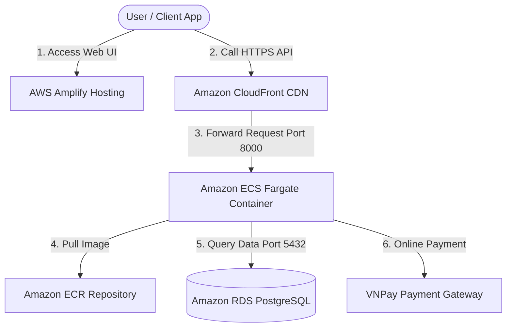

# Workshop Overview: Smart Parking System

### System Introduction

The **Smart Parking System** is a modern parking management solution combining AI Computer Vision (automatic license plate recognition ANPR & QR code scanning) with AWS Cloud Infrastructure. The platform automates advance parking reservations, generates QR reservation codes, integrates VNPay online payment, and streamlines parking operations for administrators.

### Overall Architecture on AWS

The cloud infrastructure comprises core cloud components:

1. **Frontend User Interface**:
   - Developed using **React Vite & TailwindCSS**.
   - Hosted and deployed automatically via **AWS Amplify Hosting** with CI/CD integration connected to GitHub.

2. **Content Delivery Network & API Acceleration**:
   - **Amazon CloudFront**: Functions as the single origin entry point, wrapping HTTP Backend APIs into **free secure HTTPS endpoints**, reducing latency across Edge Locations.

3. **Backend Business Microservices**:
   - Built with **Node.js / Express.js**, containerized using **Docker**.
   - Managed and versioned in **Amazon ECR (Elastic Container Registry)**.
   - Deployed and auto-scaled serverlessly using **Amazon ECS Fargate**.

4. **Database Tier**:
   - Relational Database **Amazon RDS PostgreSQL** (`parkflow-db`) storing parking slots, QR codes, user accounts, and VNPay transaction history.

5. **Security & Identity Governance**:
   - Governed by least-privilege policies using **AWS IAM Users & Roles**.
   - Secured via multi-layered **EC2 Security Groups**.

---

### Data Flow Diagram

### Key Takeaways After Hands-on Workshop

Upon completing this workshop, you will master:
- Setting up local development tools and authenticating **AWS CLI v2**.
- Provisioning and managing **Amazon RDS PostgreSQL** databases.
- Containerizing applications with **Docker** and pushing images to **Amazon ECR**.
- Deploying auto-scaling Serverless Containers on **Amazon ECS Fargate**.
- Configuring **Amazon CloudFront CDN** for API security and HTTPS encryption.
- Automating CI/CD deployment pipelines using **AWS Amplify**.