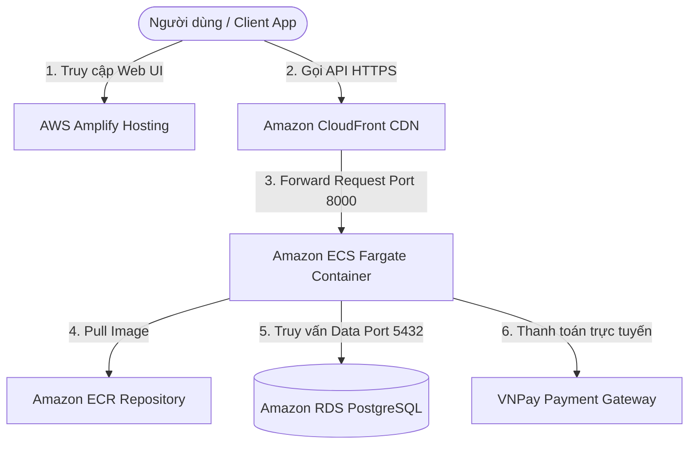

# Tổng quan về Workshop: Smart Parking System

### Giới thiệu hệ thống

Hệ thống Bãi đỗ xe Thông minh (**Smart Parking System**) là giải pháp quản lý bãi đỗ xe hiện đại kết hợp giữa công nghệ Trí tuệ nhân tạo (AI Computer Vision) và hạ tầng Điện toán đám mây điện toán đám mây AWS. Hệ thống giúp tự động hóa quy trình đặt chỗ đỗ xe trước, tạo mã QR đặt chỗ, tích hợp cổng thanh toán trực tuyến VNPay, nhận diện biển số xe tự động (ANPR) tại cổng vào/ra và tối ưu hóa quản lý bãi xe cho ban quản trị.

### Kiến trúc tổng quan trên AWS

Kiến trúc hạ tầng đám mây của hệ thống bao gồm các thành phần cốt lõi:

1. **Giao diện Người dùng (Frontend)**:
   - Được phát triển bằng **React Vite & TailwindCSS**.
   - Lưu trữ và triển khai tự động qua **AWS Amplify Hosting** với quy trình CI/CD tích hợp trực tiếp từ GitHub repository.

2. **Mạng phân phối nội dung & Tăng tốc API (CDN)**:
   - **Amazon CloudFront**: Đóng vai trò là điểm truy cập duy nhất (Origin Shield), bọc HTTP API Backend thành đường dẫn **HTTPS an toàn miễn phí**, tự động giảm độ trễ và tối ưu tốc độ truyền tải API trên Edge Locations.

3. **Tầng Xử lý Nghiệp vụ (Backend Microservices)**:
   - Ứng dụng Backend được viết bằng **Node.js / Express.js**, đóng gói trong **Docker Container**.
   - Quản lý Docker Image phiên bản tại kho lưu trữ **Amazon ECR (Elastic Container Registry)**.
   - Vận hành và điều phối tự động co giãn không máy chủ bằng **Amazon ECS Fargate**.

4. **Tầng Lưu trữ Dữ liệu (Database)**:
   - Cơ sở dữ liệu quan hệ **Amazon RDS PostgreSQL** (`parkflow-db`) lưu trữ toàn bộ thông tin chỗ đỗ, mã QR đặt chỗ, tài khoản người dùng và lịch sử giao dịch thanh toán VNPay.

5. **An ninh & Phân quyền (Security & IAM)**:
   - Quản lý danh tính và phân quyền tối thiểu bằng **AWS IAM Users & Roles**.
   - Khóa chặt các cổng giao tiếp và cô lập CSDL bằng các quy tắc **EC2 Security Groups** đa lớp.

---

### Mô hình luồng dữ liệu (Data Flow)

### Kết quả đạt được sau bài thực hành

Sau khi hoàn thành bài Workshop này, bạn sẽ nắm vững:
- Quy trình chuẩn bị môi trường và cấu hình **AWS CLI v2** an toàn.
- Khởi tạo và quản trị **Amazon RDS PostgreSQL** trên đám mây.
- Kỹ năng đóng gói **Docker** và đẩy Container Image lên **Amazon ECR**.
- Triển khai dịch vụ Container Serverless tự động co giãn trên **Amazon ECS Fargate**.
- Thiết lập **Amazon CloudFront CDN** bảo vệ và nâng cấp HTTPS cho API.
- Tự động hóa quy trình CI/CD triển khai ứng dụng Web với **AWS Amplify**.
